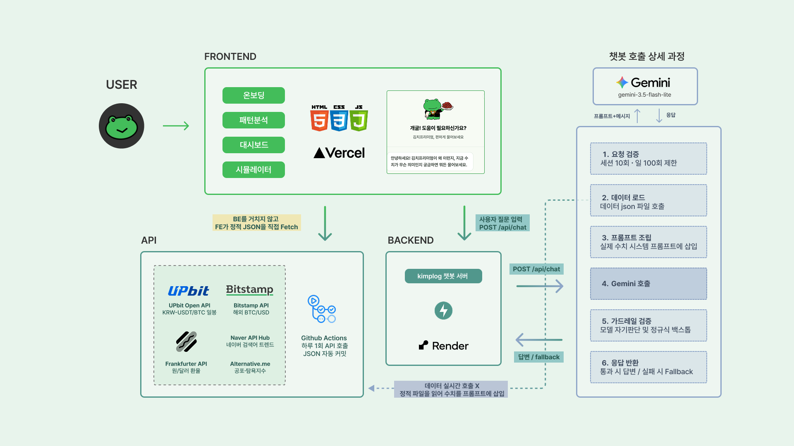

<div align="center">

<br> 

<br>

## Kimplog 
테더로 보는 김치프리미엄 관측소 <br>
김치프리미엄을 보고, 이해하고, 연습해 보는 서비스
<br>

**SNU KDT 5조** | 김도형 김은규 노현선 박채원 변수민 한윤주 <br>
[Kimplog](https://kimplog.vercel.app)

</div>


### 목차

- [프로젝트 소개](#-프로젝트-소개)
- [기술 스택](#-기술-스택)
- [시스템 구조도](#-시스템-구조도)
- [주요 기능](#-주요-기능)
- [레포 구조](#-레포-구조)
- [API 소개](#-api-소개)
- [배포 & 자동화](#-배포--자동화)

<br>

## 프로젝트 소개

**김치프리미엄**은 국내 코인 가격이 해외보다 얼마나 비싼지를 보여주는 지표지만, 정작 이 숫자 하나만 던져주는 서비스가 대부분입니다. 지금 프리미엄이 높은 건지 낮은 건지, 과거엔 어땠는지, 이 타이밍에 들어갔으면 어떻게 됐을지를 스스로 판단하기는 어렵습니다.

Kimplog는 이 숫자를 **읽는 법**부터 시작해서, **과거 데이터로 직접 체험**해보고, **궁금한 걸 바로 물어볼 수 있는** 흐름을 하나로 묶은 서비스입니다.
<br>

### 솔루션
- **온보딩**: 스크롤 인터랙션으로 김치프리미엄이 무엇인지, 왜 생기는지 가볍게 훑어보기
- **대시보드**: 실시간 프리미엄·환율·거래량·공포탐욕지수·검색 관심도를 한 화면에서 확인
- **패턴 분석**: 과거 프리미엄이 어떤 패턴으로 움직였는지 시각화
- **시뮬레이터**: 과거 특정 시점에 매수했다면 어땠을지 체험하고, 리스크 체크리스트·계산기·퀴즈로 이해 확인
- **챗봇**: 지금 이 수치가 무슨 의미인지 자연어로 질문 (매수/매도 시점은 알려주지 않습니다.)

<br>

## 기술 스택

**Frontend**
- Vanilla HTML/CSS/JavaScript (프레임워크 없이 정적 페이지 4종)
- Vercel 배포

<br>

**Backend**
- FastAPI (Python 3.12)
- Google Gemini API (`gemini-3.5-flash-lite`) — 챗봇 응답 생성
- Render 배포 (`backend/Procfile`)

<br>

**데이터 파이프라인**
- Upbit API: KRW-USDT / KRW-BTC 일봉
- Frankfurter API: 원/달러 환율
- Bitstamp API (실패 시 Coinbase로 폴백): 해외 BTC/USD 시세
- Naver API HUB: 검색어 트렌드
- GitHub Actions: 매일 자동 실행 후 `data/*.json`을 레포에 직접 커밋 (별도 DB 없음)

<br>

## 시스템 구조도
 

<br>

## 주요 기능

#### 1. 온보딩 (`pages/index`)
- 스크롤에 맞춰 김치프리미엄 개념을 단계적으로 소개 <br>

#### 2. 대시보드 (`pages/dashboard`)
- 실시간 프리미엄/환율/거래대금·거래량 카드
- 프리미엄 시계열 차트, 상장 이후 백분위 게이지, 히트맵
- 환율 리스크 비교 차트 (원/달러 vs 프리미엄)
- 공포탐욕지수, 검색어 관심도(네이버 트렌드) 연동

#### 3. 패턴 분석 (`pages/pattern`)
- 과거 프리미엄 데이터에서 반복되는 패턴을 뽑아 시각화

#### 4. 시뮬레이터 (`pages/simulator`)
- 과거 임의 시점에 매수했다고 가정하고 이후 흐름을 체험
- 투자 리스크 체크리스트, 계산기, 퀴즈로 구성

#### 5. 챗봇 (`chatbot/`)
- 전역 플로팅 위젯
- 오늘의 실제 수치를 근거로만 답하고, 매수/매도 타이밍처럼 직접적인 투자 지시성 질문은 완곡하게 돌려 답변
- 세션당 10회 / IP당 30회 / 서버 전체 하루 100회로 호출을 제한

<br>

## 레포지토리 구조

```
pages/
├── index/       index.html        # 온보딩
├── pattern/     pattern.html      # 패턴 분석
├── simulator/   simulator.html    # 시뮬레이터
└── dashboard/   dashboard.html    # 대시보드

chatbot/
└── chatbot-widget.js              # 전역 챗봇 플로팅 위젯

shared/
├── shared.css                     # 공용 디자인 시스템
├── shared.js                      # 공용 데이터 fetch (history.json)
├── nav.js                         # 공용 상단 네비게이션
└── sound.js                       # 공용 효과음

backend/
├── main.py                        # FastAPI 챗봇 API (Gemini)
├── update_data.py                 # 배치: 업비트+환율+해외시세 → data/*.json
├── fetch_naver_trend.py           # 배치: 네이버 검색어 트렌드 → naver_trend.json
├── requirements.txt
├── runtime.txt
├── Procfile
└── .env.example

assets/          이미지·사운드 등 정적 자산
data/            current.json, history.json, events.json
docs/            아키텍처·프롬프트 문서
.github/         워크플로우 (데이터 자동 갱신, 검색어 트렌드 수집)
naver_trend.json 레포 루트 — fetch_naver_trend.py 산출물
```

<br>

## API
- 챗봇용 엔드포인트 1개 `POST /api/chat`: 오늘자 김치프리미엄 데이터를 근거로 사용자 질문에 응답
- Gemini-3.5-flash-lite
- 나머지 데이터(대시보드, 패턴, 시뮬레이터)는 전부 정적 JSON(`data/current.json`, `data/history.json`)을 프론트가 직접 fetch해서 사용

<br>

**Headers**

| 이름 | 필수 | 설명 |
|---|---|---|
| `X-Session-ID` | ✅ | 세션당 호출 횟수 제한(10회)에 쓰이는 클라이언트 생성 식별자 |

**Request**

```json
{
  "message": "지금 프리미엄이 높은 편이야?"
}
```

**Response** `200 OK`

```json
{
  "reply": "지금 프리미엄은 상장 이후 상위 70% 구간이에요~ 개굴!",
  "generated_at": "2026-08-21"
}
```

<br>

**주요 제한/가드레일**

- 세션당 10회, IP당 30회, 서버 전체 하루 100회 (`429 Too Many Requests`)
- 매수/매도 타이밍·목표가 등 투자 지시성 질문에는 직접 답하지 않고 데이터 해석으로 화제를 돌려 응답 (모델 자체 판단 + 서버 사이드 백스톱 이중 검증)
- Gemini 응답 지연/과부하 시 최대 3회 재시도, 실패 시 `502`/`504`

<br>

## 배포 & 자동화

**배포**
- Frontend: Vercel
- Backend: Render. `backend/Procfile`의 `web: uvicorn backend.main:app ...`으로 기동

<br>

**데이터 자동 갱신 (GitHub Actions)**
- `update-data.yml`: 매일 KST 09:00, 업비트·환율·해외 BTC 시세를 받아 `data/current.json`·`data/history.json` 갱신 후 자동 커밋
- `naver-trend.yml`: 매일 KST 09:10, 네이버 검색어 트렌드를 받아 `naver_trend.json` 갱신 후 자동 커밋
- 둘 다 별도 DB 없이 <u>결과를 레포에 직접 커밋하는 방식</u>이라 데이터 자체가 git 히스토리로 남음
- Actions 탭에서 `workflow_dispatch`로 수동 실행도 가능
